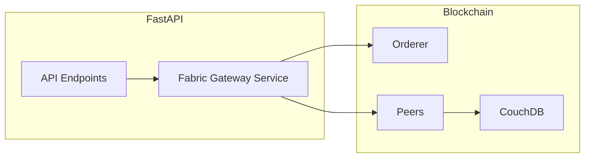

# FastAPI to Hyperledger Fabric Connection Guide

This document explains how to connect your FastAPI backend to the ChainCacao blockchain network using the Fabric Gateway (Python SDK / Node SDK).

## Recommended Architecture



## 1. Prerequisites
- `fabric-sdk-py` or `fabric-gateway` Python package.
- Connection Profile (JSON/YAML) containing network topology.
- User Identity (Cert + Private Key) for each organization.

## 2. Connection Profile Example (`connection-org1.json`)

```json
{
    "name": "chaincacao-network-prod",
    "version": "1.0.0",
    "client": {
        "organization": "OrgProducteurs",
        "connection": {
            "timeout": {
                "peer": {
                    "endorser": "300"
                }
            }
        }
    },
    "organizations": {
        "OrgProducteurs": {
            "mspid": "OrgProducteursMSP",
            "peers": ["peer0.producteurs.chaincacao.com"],
            "certificateAuthorities": ["ca.producteurs.chaincacao.com"]
        }
    },
    "peers": {
        "peer0.producteurs.chaincacao.com": {
            "url": "grpcs://localhost:7051",
            "tlsCACerts": {
                "path": "path/to/tlsca.producteurs.chaincacao.com-cert.pem"
            },
            "grpcOptions": {
                "ssl-target-name-override": "peer0.producteurs.chaincacao.com"
            }
        }
    }
}
```

## 3. Python Integration (FastAPI)

```python
from fastapi import FastAPI
from hlf_gateway import Gateway, Wallet

app = FastAPI()

@app.on_event("startup")
async def startup_event():
    # Load wallet and connection profile
    wallet = Wallet("./wallet")
    gateway = Gateway()
    await gateway.connect("./connection-org1.json", identity="admin", wallet=wallet)
    app.state.network = await gateway.get_network("chaincacaochannel")
    app.state.contract = app.state.network.get_contract("chaincacao")

@app.post("/lots")
async def create_lot(lot_id: str, product_type: str, weight: float, origin: str, producer: str):
    # Submit transaction
    result = await app.state.contract.submit_transaction(
        "CreateLot", lot_id, product_type, str(weight), origin, producer
    )
    return {"status": "success", "data": result.decode()}

@app.get("/lots/{lot_id}")
async def get_lot(lot_id: str):
    # Evaluate transaction (read-only)
    result = await app.state.contract.evaluate_transaction("GetLotById", lot_id)
    return JSONResponse(content=json.loads(result.decode()))
```

## 4. Key Security Recommendations
- Use **Environment Variables** for secrets and paths.
- Implement a **Connection Pool** for the Fabric Gateway.
- Use **Asynchronous calls** (FastAPI `async def`) to avoid blocking the API while waiting for consensus.
- Distinguish between `submit_transaction` (write) and `evaluate_transaction` (read).
