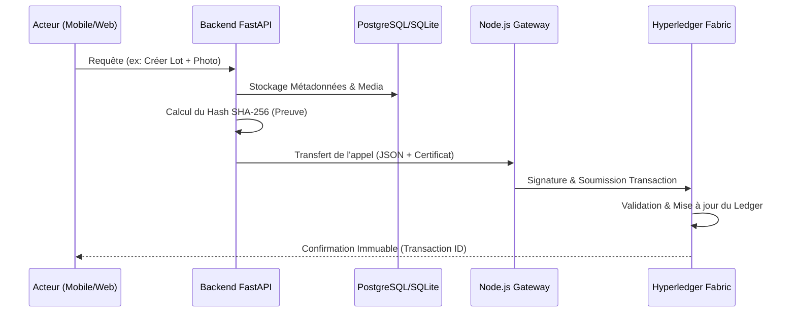

# 🏛️ ChainCacao : Référentiel Technique (Version Pro)

> **Statut du Projet** : Pilotage / Phase de Test  
> **Infrastructure** : Hyperledger Fabric Test-Network sur AWS VM (1GB RAM)  
> **Technologies** : FastAPI (Python), Node.js Gateway, CouchDB.

---

## 1. Vision et Objectifs
ChainCacao est une solution de traçabilité immuable pour la filière cacao, conçue pour garantir la conformité avec le règlement européen **EUDR (Anti-Déforestation)**. 

Elle permet de prouver :
- L'origine géographique exacte des lots (GPS).
- L'intégrité des photos de récolte (Hash SHA-256).
- La légalité de chaque acteur de la chaîne (Certificats X.509).

---

## 2. Architecture du Système

ChainCacao utilise une architecture en couches pour séparer la complexité blockchain de l'expérience utilisateur.

## 3. Fonctionnement détaillé du Backend (FastAPI)

Le backend agit comme un **intermédiaire de confiance (Middleman)**. Son rôle n'est pas seulement de transmettre des données, mais de les valider et de les enrichir avant qu'elles ne touchent la blockchain.

### 🔐 Authentification et Sécurité
Le système utilise un double mécanisme de sécurité :
1.  **Niveau Application** : Un système **OAuth2 avec JWT (JSON Web Tokens)**. L'utilisateur se connecte avec son email/mot de passe pour obtenir un token.
2.  **Niveau Blockchain** : À chaque requête sensible, le backend extrait le rôle de l'utilisateur (`PRODUCTEUR`, `EXPORTATEUR`, etc.) et le traduit en un nom d'organisation (`producteurs`, `exportateurs`). Ce nom est envoyé en header (`X-Org-Name`) à la Gateway pour charger le bon certificat.

### 💾 Stratégie de Stockage Hybride
Contrairement aux applications blockchain classiques, ChainCacao utilise une approche hybride pour garantir la performance :
-   **Base SQL (PostgreSQL/SQLite)** : Stocke les données "lourdes" et les relations complexes (profils utilisateurs, images, PDF de conformité). Cela permet des recherches instantanées et des tris impossibles sur une blockchain.
-   **Blockchain (Hyperledger Fabric)** : Stocke uniquement le **Hash (l'empreinte numérique)** des données. Si une photo est modifiée en base SQL, son hash ne correspondra plus à celui stocké sur le Ledger, révélant la fraude.

### 📐 Flux de Transfert Autorisé
Pour garantir la cohérence EUDR, le backend impose un ordre strict via l'endpoint `/recipients` :
1.  **Producteur** ➔ peut envoyer à ➔ **Coopérative**
2.  **Coopérative** ➔ peut envoyer à ➔ **Transformateur**
3.  **Transformateur** ➔ peut envoyer à ➔ **Exportateur**
4.  **Exportateur** ➔ peut envoyer à ➔ **Acheteur Final / Exportateur**

### ⚙️ Cycle de vie d'une transaction type
1.  **Validation** : Le backend vérifie via Pydantic (`schemas.py`) que les données sont conformes.
2.  **Persistance locale** : Les métadonnées sont sauvées en base SQL.
3.  **Anonymisation** : Le backend ne transmet à la Gateway que les IDs et les Hashes nécessaires à la traçabilité.
4.  **Consommation Gateway** : Le service `blockchain_gateway.py` appelle l'API REST de la Gateway Node.js.

### 🖼️ Gestion des Preuves Multimédias (Photos/PDF)
Le backend ne stocke **JAMAIS** de fichiers binaires sur la blockchain (trop coûteux). 
- Le fichier est reçu par le contrôleur `/uploads`.
- Il est stocké sur le disque (`storage.py`).
- Son **Hash SHA-256** est calculé.
- Seul ce Hash est envoyé au Chaincode pour être ancré dans le temps.
- Lors d'un audit, le backend recalcule le hash du fichier local et le compare à celui de la blockchain.

### 🛑 Gestion des Erreurs et Résilience
Le backend intègre un traducteur d'erreurs pour éviter d'exposer des logs cryptiques à l'utilisateur :
- `MVCC_READ_CONFLICT` -> "Erreur de concurrence : veuillez réessayer la transaction."
- `LOT_INEXISTANT` -> "404 : Le lot spécifié n'a pas été trouvé sur le registre."
- `10 ABORTED` -> "Erreur technique d'endossement (vérifier la disponibilité du peer)."


### 🔄 Flux de Données et Orchestration


### 🌍 Spécificité du Réseau de Test (AWS VM)
> [!IMPORTANT]
> Pour optimiser les ressources sur la VM de 1 Go de RAM, la Gateway est configurée en mode **"Ultra-Light Mapping"**. 
> - Toutes les transactions sont routées techniquement via l'organisation `OrgTestMSP`.
> - Le Smart Contract possède un bypass de sécurité pour accepter les signatures de `OrgTestMSP` peu importe le rôle déclaré.

---

## 4. Gouvernance et Sécurité

### 🔑 Gestion des Identités
L'authentification est gérée sur deux niveaux :
1. **Applicatif** : JWT (JSON Web Tokens) pour les sessions HTTP.
2. **Blockchain** : Chaque utilisateur possède un fichier `.id` dans le `wallet/` de la Gateway. Ce fichier contient son certificat X.509 et sa clé privée.

### 🛡️ Mapping Rôles -> Organisations
Le backend (`schemas.py`) et la gateway s'appuient sur le mapping suivant :
- **PRODUCTEUR** : `producteurs`
- **EXPORTATEUR** : `exportateurs`
- **CERTIF** : `certif`
- **MINISTERE** : `test` (Rôle d'audit racine)

---

## 5. Logique du Smart Contract (Chaincode)

Développé en Node.js, le chaincode est structuré de manière modulaire :
- **ActorLogic** : Enregistrement et validation hiérarchique.
- **LotLogic** : Création de lots, gestion des certifications et des bundles (regroupements).
- **TraceabilityLogic** : Transferts, transformations industrielles et expéditions.
- **ParcelleLogic** : Géolocalisation et conformité EUDR.

---

## 6. Guide d'Exploitation (DevOps)

### Commandes de base (Dossier `blockchain/scripts/`)
- **Démarrage** : `./bootstrap-fabric.sh`
- **Réinitialisation** : `./reset-network.sh` (Efface tout le ledger de test).
- **Déploiement Smart Contract** : `./deploy-chaincode.sh`.

### Surveillance des Logs
- **Gateway** : `pm2 logs chaincacao-gateway`
- **Containers Fabric** : `docker logs peer0.org1.example.com --tail 50`

---

## 7. Structure du Code et Arborescence

```text
ChainCacao/
├── backend/                # FastAPI Application
│   ├── api/v1/endpoints/   # Contrôleurs par domaine (lots, actors, etc.)
│   ├── models/             # Schémas Pydantic et modèles SQLAlchemy
│   ├── services/           # Logique métier (storage, blockchain_gateway)
│   └── main.py             # Point d'entrée de l'API
├── blockchain/
│   ├── chaincode/          # Smart Contracts (Logic, Models, Utils)
│   ├── gateway/            # API de pont Node.js (Express)
│   └── scripts/            # Scripts d'automatisation Fabric
├── docs/                   # Documentation technique et schémas
└── web/                    # Interface d'administration (React/Next.js)
```

## 8. Topologie de Déploiement (AWS)

La VM AWS (Ubuntu) orchestre plusieurs couches :
1. **Nginx** : Reverse proxy gérant le SSL et redirigeant le trafic vers le Backend (port 8000) ou la Gateway (port 3000).
2. **PM2** : Gestionnaire de processus pour maintenir le Backend et la Gateway actifs en 24/7.
3. **Docker Compose** : Isole les composants Hyperledger Fabric (Peers, Orderer, CouchDB) dans des containers dédiés.

---

## 📖 Glossaire Technique (Étendu)

- **Chaincode** : Le "Smart Contract" version Hyperledger Fabric. Il contient la logique métier et les règles de validation.
- **MSP (Membership Service Provider)** : L'autorité qui définit qui appartient à quelle organisation.
- **Endorsement (Endossement)** : Le processus où les nœuds (Peers) simulent une transaction et la signent pour prouver qu'elle est valide.
- **Ledger (Registre)** : Composé du *World State* (état actuel) et de l'historique de toutes les transactions.
- **CouchDB** : Base de données NoSQL utilisée par Fabric pour permettre des requêtes complexes sur les lots de cacao.
- **Gateway** : Interface (Node.js) qui simplifie la communication entre le monde web (REST) et le monde blockchain (gRPC).
- **Asset (Actif)** : Tout objet tracé sur la blockchain (Lot, Parcelle, Acteur).
- **Asset Hash / Key** : La clé unique (souvent un Hash SHA-256) permettant de retrouver un actif et son historique complet sur le registre.

## 🚀 Références Rapides des Endpoints

| Domaine | Endpoint | Description |
| :--- | :--- | :--- |
| **Authentification** | `/api/v1/auth/login` | Échange email/pass contre un Token JWT. |
| **Acteurs** | `/api/v1/actors/recipients` | Liste les destinataires autorisés selon le rôle (Filtre intelligent). |
| **Lots** | `/api/v1/lots/create` | Crée un lot avec hash de photo et GPS. |
| **Transferts** | `/api/v1/traceability/transfer` | Change le propriétaire d'un lot (ex: Producteur -> Coop). |
| **Audit** | `/api/v1/audit/history/{assetHash}` | Récupère l'historique immuable complet (Provenance, Transferts). |

---
*Fin du document technique ChainCacao - Version 1.2*
